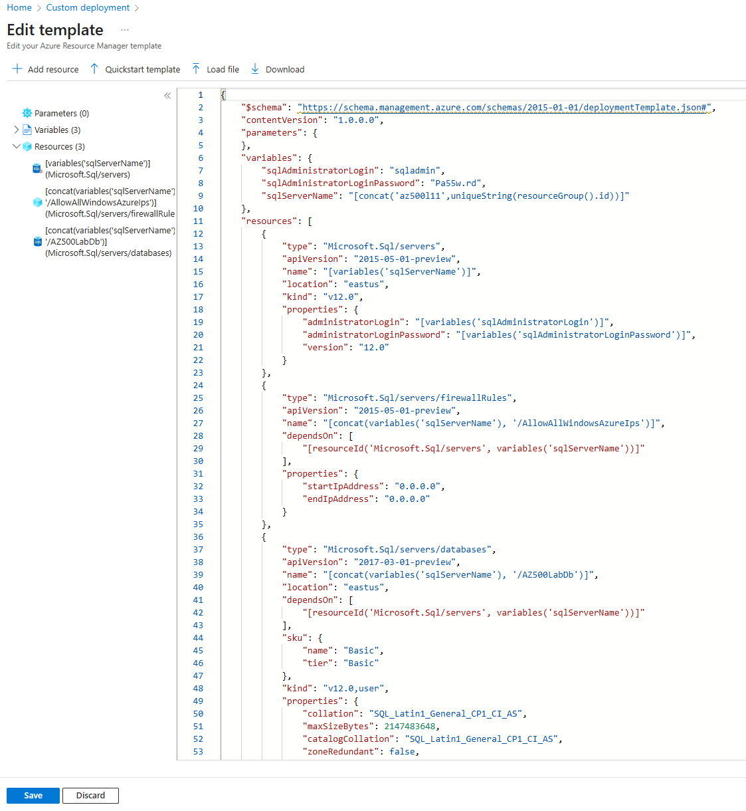
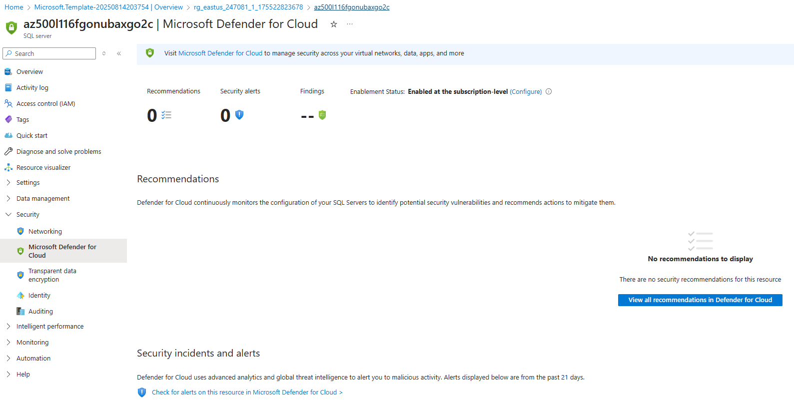
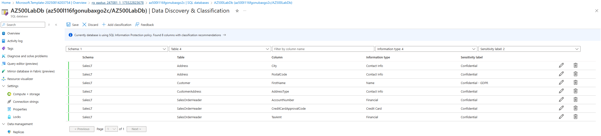
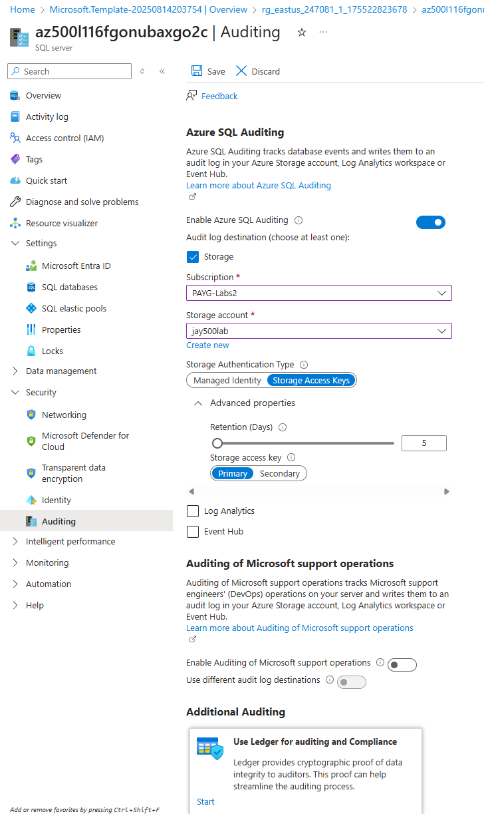

# Securing Azure SQL Database – Whizlabs Lab Implementation

Type: Lab Project — AZ-500 Studies  
Skills: Azure SQL Security, Microsoft Defender for SQL, Data Classification, Auditing

* * *

## Overview

This project replicates the **Whizlabs “Securing Azure SQL Database”** lab in a real Azure environment.  
It covers provisioning an Azure SQL Database and applying core security controls, including Microsoft Defender for SQL, Data Classification, and Auditing.

Lab link: [Whizlabs – Securing Azure SQL Database](https://www.whizlabs.com/labs/securing-azure-sql-database)

* * *

## Objectives

- Sign in to the **Azure Portal**
- Deploy an **Azure SQL Database** using a custom ARM template
- Enable **Microsoft Defender for SQL** (Advanced Data Protection)
- Configure **Data Discovery & Classification**
- Enable and configure **Auditing** with storage and retention settings

* * *

## What I Did

### 1) Sign in to Azure Portal
- Accessed [Azure Portal](https://portal.azure.com).

### 2) Deploy Azure SQL Database
- Used **Deploy a custom template** option in the Azure Portal.
- Loaded the provided `AzureSQL.json` template file.
- Selected the lab resource group and East US region.
- Validated and deployed the SQL Server database.

### 3) Configure Advanced Data Protection
- Enabled **Microsoft Defender for SQL** at the server level via Microsoft Defender for Cloud.
- Reviewed vulnerability assessment and advanced threat protection settings.
- Viewed recommendations and security alerts (noting they may take time to populate).

### 4) Configure Data Classification
- Navigated to the SQL database’s **Data Discovery & Classification** blade.
- Added classifications for:
  - `SalesLT.Customer.FirstName` → *Information type*: Name, *Sensitivity label*: Confidential – GDPR
- Saved classifications and confirmed updates in the overview.

### 5) Configure Auditing
- Enabled **Azure SQL Auditing** at the server level.
- Created a new storage account (`whizstorage<name>`) for audit logs.
- Set retention period to **5 days**.
- Viewed audit logs from both server and database perspectives.

* * *

## Screenshots

- **SQL Database deployed via custom template**  
  

- **Microsoft Defender for SQL enabled**  
  

- **Data classification added**  
  

- **Auditing configured with storage**  
  

* * *

## Next Steps (outside the lab)

- Configure **Always Encrypted** for column-level security.
- Implement **Dynamic Data Masking** for sensitive fields.
- Integrate Azure SQL logs into **Microsoft Sentinel** for centralized monitoring.
- Create alert rules for Defender for SQL threat detection events.

* * *

## References

- [Whizlabs – Securing Azure SQL Database Lab](https://www.whizlabs.com/labs/securing-azure-sql-database)  
- [Microsoft Docs – Security overview of Azure SQL Database](https://learn.microsoft.com/en-us/azure/azure-sql/database/security-overview)
